<div align="center">


<br/>

[](https://github.com/claude-ui-monitor/claude-ui-monitor)
[](https://nodejs.org)
[](https://claude.ai/code)
[](LICENSE)
[](framework-registry.json)

<br/>

*Every time you edit a frontend file, Claude automatically screenshots 3 viewports,
runs Lighthouse, checks accessibility, and fixes what it finds — no prompting needed.*

</div>

---

## How it works

```mermaid
flowchart LR
    A([Edit frontend file]) --> B[ui-check.ps1\nPostToolUse hook]
    B --> C{Dev server\nrunning?}
    C -- No --> D([Silent exit])
    C -- Yes --> E[Detect framework\n17+ supported]
    E --> F[Emit trigger\nto Claude]
    F --> G[Lighthouse\nBEFORE]
    G --> H[Screenshots\nDesktop · Mobile · Tablet]
    H --> I[Console errors\nNetwork failures\nA11y violations]
    I --> J{Issues\nfound?}
    J -- Yes --> K[Fix source files]
    K --> L[Lighthouse\nAFTER]
    J -- No --> L
    L --> M[Re-screenshot\nconfirm fix]
    M --> N[Append to\nui-audit-log.jsonl]
    N --> O([2-sentence summary])

    style A fill:#7C3AED,color:#fff
    style O fill:#22C55E,color:#fff
    style D fill:#6B7280,color:#fff
    style K fill:#F59E0B,color:#000
```



---

## What gets checked on every save

<table>
<tr>
<td width="50%">

**Visual**
- Desktop (1280×800)
- Mobile (390×844)
- Tablet (768×1024)
- Layout breaks, overflow, low contrast
- Missing images, broken fonts

</td>
<td width="50%">

**Quality**
- Lighthouse: performance + accessibility
- axe-core accessibility violations
- Console JS errors & warnings
- Network 4xx / 5xx failures

</td>
</tr>
<tr>
<td>

**Figma** *(optional)*
- Design-vs-live pixel diff
- CSS design token drift detection
- Baseline export from any frame

</td>
<td>

**Auto-fix**
- Issues are fixed in source files
- Lighthouse re-run confirms no regression
- Everything logged to audit history

</td>
</tr>
</table>

### Always included in every `pw-e2e-test.js` JSON output

Every screenshot run (hook or manual) includes these zero-overhead audits:

| Field | What it reports |
|---|---|
| `meta` | `title`, `viewport`, `blocksZoom` (WCAG 1.4.4), `lang`, `charset`, `dir`; `issues[]` for zoom-blocking or missing `lang` |
| `images` | Broken, missing alt, oversized; **lazy-above-fold** (hurts LCP); **missing `fetchpriority`** on hero images; **missing `srcset`** on wide images |
| `scripts` | **Render-blocking** third-party scripts that delay page display |
| `touchTargets` | Interactive elements below **24×24px** (WCAG 2.5.8 AA) — `failingAA` count + element details |
| `headings` | `h1Count`, heading **level skips** (h2→h4 etc.), `warnings[]` (WCAG 2.4.6) |
| `domA11y` | **Broken ARIA ID references** (`aria-labelledby` etc.); **unlabeled form inputs** (WCAG 1.3.1) |
| `layout` | **Horizontal scroll** / viewport overflow — `hasHorizontalScroll`, `wideElements[]`; **overflow-hidden clipping** — `hiddenOverflowElements[]` |
| `bundle` | JS / CSS / image KB; largest + slowest resources |
| `fonts` | Loaded/failed fonts, FOIT risk (`font-display: auto/block`), FOUT risk (`swap`) |
| `typography` | Font-size < 16px on mobile (triggers iOS auto-zoom); line-height < 1.2 (WCAG 1.4.12); `text-overflow:ellipsis` truncation |
| `interactiveStates` | CSS `:hover` / `:focus` / `:disabled` rule counts — flags missing interactive state styles |
| `cursor` | Interactive elements missing `cursor:pointer` — users get no click affordance |
| `viewportUnits` | CSS rules using `height:100vh` — clipped by mobile browser chrome (use `dvh` instead) |
| `mediaQuerySupport` | Whether CSS contains `prefers-color-scheme: dark` and `prefers-reduced-motion: reduce` media queries |
| `formUX` | `email`/`password`/`tel` inputs missing `autocomplete` — mobile autofill won't work |
| `animationDurations` | Transitions > 300ms (sluggish hover/focus); animations > 1s (feels slow) |
| `stacking` | Elements with `z-index > 9999` — likely copy-pasted modal fixes causing stacking anomalies |

**Optional flag-gated checks:**

| Flag | What it adds | Overhead |
|---|---|---|
| `--dark-mode` | Extra screenshot + **axe-core run** with `prefers-color-scheme: dark` → `darkMode.out` + `darkModeA11y` | ~300ms |
| `--cwv` | Core Web Vitals: LCP / **CLS+sources** / FCP / TTFB / **TBT** with ratings | ~5-8s |
| `--compare=<path>` | Pixel-diff vs baseline PNG; diff PNG written to disk; auto-creates baseline on first run | ~50ms |
| `--reduced-motion` | Extra screenshot with `prefers-reduced-motion: reduce` (WCAG 2.3.3) → `reducedMotion.out` | ~200ms |
| `--forced-colors` | Extra screenshot with Windows High Contrast Mode (`forced-colors: active`) → `forcedColors.out` | ~200ms |
| `--print` | Extra screenshot with `media: print` — verifies print stylesheet → `print.out` | ~200ms |
| `--no-js` | Screenshot with JavaScript **disabled** — flags blank SPAs without SSR → `noJs` | ~2s |
| `--focus-audit` | Tab through up to 20 focusable elements; flags **missing focus rings** (WCAG 2.4.7) → `focusAudit` | ~3-5s |
| `--link-check` | HEAD-checks all internal links (cap 20); flags broken ones → `linkCheck` | ~3-10s |
| `--reflow` | 320px viewport screenshot + horizontal scroll check (WCAG 1.4.10 Reflow) → `reflow` | ~2s |
| `--text-spacing` | Inject WCAG 1.4.12 overrides; screenshot + detect clipped text → `textSpacing` | ~500ms |
| `--paint-complexity` | Detect expensive `filter`/`backdrop-filter`/multi-shadow on large elements → `paintComplexity` | ~100ms |
| `--state-contrast` | WCAG 1.4.3 contrast ratio in default + hover state for buttons and links → `stateContrast` | ~2-5s |

---

## Prerequisites

| Requirement | Install |
|---|---|
| Windows 10/11 | — |
| PowerShell 7+ | `winget install Microsoft.PowerShell` |
| [Claude Code](https://claude.ai/code) | CLI or desktop app |
| Node.js 18+ | `winget install OpenJS.NodeJS` |
| LLM API key (one of) | [Groq](https://console.groq.com) (free) · [OpenAI](https://platform.openai.com) · [Anthropic](https://console.anthropic.com) |

---

## Install

```powershell
git clone https://github.com/claude-ui-monitor/claude-ui-monitor.git
cd claude-ui-monitor
pwsh -File install.ps1
```

> Safe to re-run after `git pull` — all steps are idempotent. Your `.env` and `project-registry.json` are never overwritten.

### What the installer does

- Copies scripts and agents to `~/.claude/`
- **Merges** the PostToolUse hook into your existing `~/.claude/settings.json`
- **Merges** MCP servers (playwright, chrome-devtools-mcp, figma) into your existing `~/.claude.json`
- Appends UI Monitor instructions to `~/.claude/CLAUDE.md`
- Runs `npm install` and installs Playwright Chromium
- Installs stylelint globally

---

## Add your first project

Edit `~/.claude/project-registry.json`:

```jsonc
{
  "projects": [
    {
      "name": "My App",
      "path": "C:\\Users\\yourname\\my-app",
      "framework": "React",
      "port": 3000,
      "start": "npm run dev",
      "routes": null         // null = homepage only (default)
                             // "auto" = discover all routes
                             // ["/", "/about"] = specific pages
    }
  ]
}
```

That's it. Start your dev server, edit a UI file, and the monitor activates automatically.

---

## Supported frameworks

<div align="center">

| Frontend | Backend / Dashboards |
|---|---|
| Angular · React · Vue · Svelte/SvelteKit | Flask · FastAPI · Django |
| Next.js · Nuxt · Remix · Astro | Streamlit · Gradio · Panel |
| Vite (generic) · Static HTML | Solara · Marimo |

Unknown frameworks are **auto-detected and registered** from process name, command line, and HTTP fingerprint.

</div>

---

## Commands

```powershell
# View audit history across all projects
pwsh -File ~/.claude/scripts/audit-log.ps1 -Summary

# Manual sweep of all live projects
pwsh -File ~/.claude/scripts/sweep-all.ps1

# Manual sweep + auto-fix any issues
pwsh -File ~/.claude/scripts/sweep-all.ps1 -Fix

# Schedule automatic nightly sweeps (Windows Task Scheduler)
pwsh -File ~/.claude/scripts/schedule-sweep.ps1

# Screenshot a URL manually (outputs JSON + PNG with full UI/UX audit)
node ~/.claude/scripts/pw-e2e-test.js http://localhost:3000 out.png 1280 800

# Multi-page: screenshot every route/tab
node ~/.claude/scripts/pw-e2e-test.js http://localhost:3000 out 1280 800 --routes=auto --nav=link-crawl

# Advanced UI: auto-detect animations, canvas, WebGL, GSAP, Framer Motion, Lottie
# Returns JSON with an 'advanced' key containing fps, frames, hover, scroll, and video fields
node ~/.claude/scripts/pw-e2e-test.js http://localhost:3000 out 1280 800 --detect-advanced

# Explicit advanced capture flags (combinable)
node ~/.claude/scripts/pw-e2e-test.js http://localhost:3000 out 1280 800 --animated   # multi-frame snapshots + FPS
node ~/.claude/scripts/pw-e2e-test.js http://localhost:3000 out 1280 800 --hover       # screenshot interactive element hover states
node ~/.claude/scripts/pw-e2e-test.js http://localhost:3000 out 1280 800 --scroll      # screenshot at 25/50/75/100% scroll depth
node ~/.claude/scripts/pw-e2e-test.js http://localhost:3000 out 1280 800 --video       # record a .webm of animated content

# Extended checks (combinable with any of the above)
node ~/.claude/scripts/pw-e2e-test.js http://localhost:3000 out.png 1280 800 --dark-mode         # dark mode screenshot + axe in dark
node ~/.claude/scripts/pw-e2e-test.js http://localhost:3000 out.png 1280 800 --cwv               # Core Web Vitals (LCP/CLS+sources/FCP/TTFB/TBT)
node ~/.claude/scripts/pw-e2e-test.js http://localhost:3000 out.png 1280 800 --compare=base.png  # pixel-diff vs baseline
node ~/.claude/scripts/pw-e2e-test.js http://localhost:3000 out.png 1280 800 --reduced-motion    # prefers-reduced-motion screenshot (WCAG 2.3.3)
node ~/.claude/scripts/pw-e2e-test.js http://localhost:3000 out.png 1280 800 --forced-colors     # Windows High Contrast Mode screenshot
node ~/.claude/scripts/pw-e2e-test.js http://localhost:3000 out.png 1280 800 --print             # print stylesheet screenshot
node ~/.claude/scripts/pw-e2e-test.js http://localhost:3000 out.png 1280 800 --no-js             # JS-disabled screenshot (SSR/progressive enhancement check)
node ~/.claude/scripts/pw-e2e-test.js http://localhost:3000 out.png 1280 800 --focus-audit       # keyboard focus ring visibility audit
node ~/.claude/scripts/pw-e2e-test.js http://localhost:3000 out.png 1280 800 --link-check        # broken internal link check (cap 20)
node ~/.claude/scripts/pw-e2e-test.js http://localhost:3000 out.png 1280 800 --reflow            # WCAG 1.4.10 reflow at 320px viewport
node ~/.claude/scripts/pw-e2e-test.js http://localhost:3000 out.png 1280 800 --text-spacing      # WCAG 1.4.12 text-spacing override clipping check
node ~/.claude/scripts/pw-e2e-test.js http://localhost:3000 out.png 1280 800 --paint-complexity  # expensive CSS paint properties on large elements
node ~/.claude/scripts/pw-e2e-test.js http://localhost:3000 out.png 1280 800 --state-contrast    # WCAG 1.4.3 contrast in default + hover state
```

---

## Cross-browser check with Selenium

The Playwright-based workflow uses Chromium. Selenium drives the **real browsers installed on your machine** (Chrome, Edge, and Firefox), which catch browser-specific rendering bugs and console errors that Chromium alone won't surface.

```powershell
# Screenshots in Chrome, Edge, and Firefox — compare rendering side by side
node ~/.claude/scripts/selenium-xbrowser.js http://localhost:3000 out

# Chrome and Edge only (skip Firefox if not installed)
node ~/.claude/scripts/selenium-xbrowser.js http://localhost:3000 out --browsers=chrome,edge

# Screenshot a specific component in each browser
node ~/.claude/scripts/selenium-xbrowser.js http://localhost:3000 out --element=".hero-section"

# Test CSS print layout — produces a .pdf from each browser's print engine
node ~/.claude/scripts/selenium-xbrowser.js http://localhost:3000 out --pdf
```

Output is a JSON array — one entry per browser with `out` (screenshot path), `consoleErrors`, and `networkErrors`. Browsers that aren't installed return `{ ok: false, skipped: true }` and are silently ignored by the monitor.

**Why Selenium for this, not Playwright?**
- Console errors and JS exceptions are captured via **WebDriver BiDi** — a W3C standard that works on Firefox natively, unlike CDP which is Chromium-only
- `printPage()` is a W3C WebDriver command supported by Chrome, Edge, and Firefox; Playwright's `page.pdf()` works only in Chromium
- Element-level screenshots via `element.takeScreenshot()` — useful for component visual regression
- Selenium Manager (bundled) downloads the correct driver automatically — no PATH setup

This check runs on demand, not in the automatic PostToolUse hook (three browsers × ~30s would be too slow for every edit).

---

## Auto-fix control

By default Claude fixes UI issues automatically. This can be overridden globally or per project in `~/.claude/project-registry.json`:

```jsonc
{
  "autofixDefault": false,   // turn off for ALL projects
  "projects": [
    {
      "name": "My App",
      "port": 3000,
      "autofix": true        // override global default for this project (true/false/null)
    }
  ]
}
```

When auto-fix is **off**, Claude reports the issues and asks whether to fix them. If there are more than 15 issues, the full list is written to the audit log and you're given the `audit-log.ps1 -Summary` command to view it.

---

## API key handling

Scripts fail loudly rather than silently. When a required key is missing or invalid, the script outputs structured JSON to stdout:

```json
{"ok": false, "error": "GROQ_API_KEY is not set", "action": "Add GROQ_API_KEY=... to ~/.claude/.env", "envFile": "~/.claude/.env"}
```

Claude reads the `action` field and surfaces it to you immediately. Keys go in `~/.claude/.env`:

| Key | Provider | Free tier |
|---|---|---|
| `GROQ_API_KEY` | [console.groq.com](https://console.groq.com) | Yes |
| `OPENAI_API_KEY` | [platform.openai.com](https://platform.openai.com) | No |
| `ANTHROPIC_API_KEY` | [console.anthropic.com](https://console.anthropic.com) | No |
| `FIGMA_ACCESS_TOKEN` | Figma → Settings → Security | Yes |

---

## Figma integration *(Starter plan compatible)*

```powershell
# 1. Get token: Figma → Settings → Security → Personal access tokens (scope: file_content:read)
# 2. Add to ~/.claude/.env:
#    FIGMA_ACCESS_TOKEN=your_token_here
#    FIGMA_FILE_KEY=the_id_from_your_figma_url

# List all frames in your Figma file
node ~/.claude/scripts/figma-baseline.js --file=YOUR_FILE_KEY --list

# Export frames as PNG baselines
node ~/.claude/scripts/figma-baseline.js --file=YOUR_FILE_KEY --nodes=ID1,ID2

# Compare live app CSS against design tokens (export from Tokens Studio plugin)
node ~/.claude/scripts/figma-token-check.js http://localhost:3000 --tokens=~/.claude/design-tokens.json
```

When the Figma MCP server is active, Claude automatically diffs live screenshots against Figma designs as part of the 12-step protocol.

---

## MCP servers installed

| Server | Tools | Fallback |
|---|---|---|
| `@playwright/mcp` | `browser_navigate`, `browser_take_screenshot`, `browser_snapshot` | `pw-e2e-test.js` (always available) |
| `chrome-devtools-mcp` | `lighthouse_audit`, `list_console_messages`, `list_network_requests` | Skipped gracefully |
| `@figma/mcp` | `get_screenshot`, `get_metadata`, `get_design_context` | `figma-baseline.js` |

MCP tools load at conversation start. If not available mid-session, the Node.js scripts take over automatically.

---

## Contributing

A pre-commit hook in `.githooks/pre-commit` scans staged files for restricted identifiers before every commit. It is activated automatically by `install.ps1`. To activate manually:

```bash
git config core.hooksPath .githooks
```

## Updating

```powershell
cd claude-ui-monitor
git pull
pwsh -File install.ps1
```

`framework-registry.json` and all scripts are always updated. Your `project-registry.json`, `.env`, and `CLAUDE.md` content are preserved.

---

## Use with Codex or other agents

The Node.js scripts are platform-agnostic and can be called from any CI pipeline or agent:

```bash
node scripts/pw-e2e-test.js http://localhost:3000 out.png          # screenshot + a11y
node scripts/figma-baseline.js --file=KEY --list                    # list Figma frames
node scripts/figma-token-check.js http://localhost:3000             # token drift check
node scripts/stagehand-fallback.js http://localhost:3000 "task"    # AI browser
```

The automatic PostToolUse hook and `CLAUDE.md` protocol are Claude Code-specific.

---

<div align="center">

MIT License · Built for [Claude Code](https://claude.ai/code)

</div>
